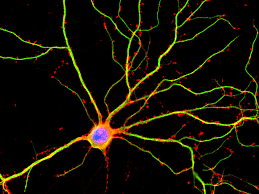
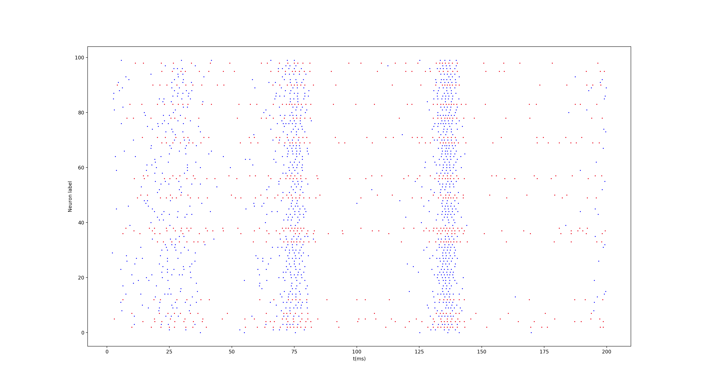

# Simulation of in-vitro population of neurons.

This code can be used to simulate multiple population of in-vitro neurons.
It demonstrates interesting properties of these systems, as the bursts that correspond to an activation of the entire neuronal population.

The neurons' dynamic is simulated using an Izhikevich model (https://www.izhikevich.org/publications/spikes.htm) that allows to reproduce most of the natural behaviors of neurons.

Electronic version of the figure and reproduction permissions are freely available at www.izhikevich.com
